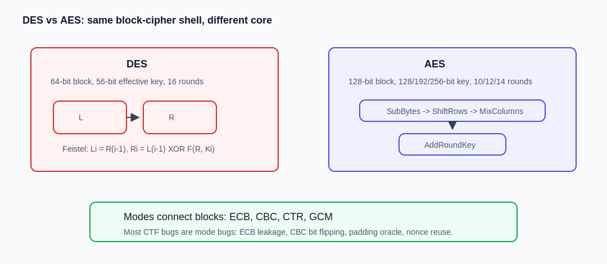

# AES 与 DES：分组密码原理与逆向识别

> AES 和 DES 都是分组密码，但它们不是母子关系，更像前后两个时代的标准。DES 是 1970s 的产物，AES 是 2000s 后真正大量使用的主力。把它们放在一起讲，是因为逆向里很多工作不是“手推 AES”，而是识别程序用了什么库、什么模式、key/iv 从哪来，然后把同样的流程搬到 Python 里复现。
> 
> DES 现在更像一个经典教材例子，有点像学汇编时绕不开 16 位实模式：不一定天天用，但很适合拿来理解结构。它是 Feistel 网络，64 bit 分组，16 轮，有效密钥 56 bit。
> 
> AES 则是现代标准里的主力，SPN 结构，128 bit 分组，密钥可以是 128/192/256 bit。把它们放在一起看，不是为了少写一篇，虽然也确实少写了一篇（），而是因为很多 CTF 坑都不在算法核心，而在“分组密码怎么被拿来用”这一层。

## 图解：DES 与 AES 结构对照



这张图只用来建立直觉：DES 里面是左右两半来回 Feistel，AES 里面是一个 4x4 字节矩阵反复做替换和扩散。逆向时通常不用手写完整 AES/DES 轮函数，更多是靠库函数名、常量表、模式字符串和 key/iv 数据流把它认出来。

## 实战识别

如果是普通 Windows/Linux 程序，先看导入表和字符串。看到 `AES_set_encrypt_key`、`EVP_aes_128_cbc`、`CryptEncrypt`、`BCryptEncrypt`、`javax.crypto.Cipher`、`AES/CBC/PKCS5Padding` 这类东西，比去找 S 盒快得多。很多题根本不是自己实现 AES，而是调用库；这时重点就是往上追 key、iv、mode、padding 从哪来。

如果没有明显库调用，再考虑搜常量。AES 自实现里可能有 S 盒表，开头常见 `63 7c 77 7b f2 6b 6f c5 ...`；DES 自实现会有一堆 IP、E、P、S-box 表，数字表很多，看着像“密密麻麻的置换表”。新手不需要一眼认完所有表，能判断“这里大概率是 AES/DES 自实现”就够了，后面可以先动态调试看输入输出。

实际做题时最重要的是复现链路。比如程序先 `md5(password)` 得到 16 字节 key，再从文件头取 16 字节 IV，最后 AES-CBC 解密资源，那脚本里也必须一模一样。少一步 hash、hex 解码方向错、IV 少截一字节，结果都会像“算法不对”，但其实只是参数没对齐。

所以 AES/DES 逆向题的优先级一般是：先判断是不是库调用，再找模式字符串和 key/iv，再看 padding，最后才考虑算法内部。如果只是普通 CTF crackme，很多时候根本不需要手搓 AES 轮函数，能把参数追出来就已经赢一半了。

## 1. 总览对照

| 算法 | DES | AES |
| --- | --- | --- |
| 结构 | Feistel 网络 | SPN，Substitution-Permutation Network |
| 分组长度 | 64 bit，8 字节 | 128 bit，16 字节 |
| 密钥长度 | 64 bit 输入，56 bit 有效 | 128/192/256 bit |
| 轮数 | 16 | 10/12/14 |
| 非线性来源 | 8 个 S 盒，6 bit -> 4 bit | 字节 S 盒，8 bit -> 8 bit |
| 扩散方式 | E 扩展、P 置换、多轮左右交换 | ShiftRows、MixColumns |
| 解密方式 | 子密钥倒序 | 使用逆变换 |
| 安全状态 | 单 DES 已不安全 | 正确使用时仍是主流 |

它们的共同点其实很朴素：算法核心只管一个固定长度分组，DES 是 8 字节，AES 是 16 字节。真实消息一长，就必须靠工作模式把一块块串起来；ECB/CBC 这类模式还要处理 padding；只加密不认证时，密文被人改了也未必能发现。所以 CTF 里很少让你正面“打穿 AES”，更多是在模式、padding、nonce、IV、编码这些地方动手脚。

## 2. 算法详解：分组密码共同框架

```text
C = E(K, P)
P = D(K, C)
```

核心算法都只是处理一个 block，遇到很长的内容时，通常会走这样一条路：

```text
明文 -> padding -> 切块 -> 工作模式 -> 密文
```

所以 DES-CBC 和 AES-CBC 的很多解密思路是相通的。bit flipping 也好，padding oracle 也好，本质都来自 CBC 的结构，不是来自 AES 或 DES 哪个 S 盒更玄学。区别主要是分组大小：DES 8 字节，AES 16 字节。

## 3. DES 原理

### 3.1 DES 参数

| 项目 | 内容 |
| --- | --- |
| 分组长度 | 64 bit |
| 输入密钥 | 64 bit |
| 有效密钥 | 56 bit |
| 轮数 | 16 |
| 结构 | Feistel |

DES 总流程：

```text
64 bit 明文
 -> IP 初始置换
 -> L0 || R0，各 32 bit
 -> 16 轮 Feistel
 -> R16 || L16
 -> FP / IP^-1
 -> 64 bit 密文
```

### 3.2 Feistel 结构

第 i 轮：

```text
Li = R(i-1)
Ri = L(i-1) XOR F(R(i-1), Ki)
```

Feistel 的关键是：`F` 函数不需要可逆，整体仍然能解密。解密时只要把子密钥倒序使用：

```text
K16, K15, ..., K1
```

### 3.3 DES 轮函数 F

```text
R(32)
 -> E 扩展置换，32 -> 48
 -> XOR 子密钥 Ki，48 bit
 -> S 盒替代，8 * (6 -> 4)
 -> P 置换，32 bit
```

S 盒输入 6 bit：

```text
b1 b2 b3 b4 b5 b6
row = b1b6
col = b2b3b4b5
```

S 盒是 DES 的主要非线性来源。

### 3.4 DES 密钥调度

1. 输入 64 bit key。
2. PC-1 去掉奇偶校验位，得到 56 bit。
3. 拆成 `C0`、`D0`，各 28 bit。
4. 每轮循环左移 1 或 2 位。
5. PC-2 选出 48 bit 轮密钥。

DES key 看似 8 字节，实际上每个字节里有 1 bit 是校验位，有效安全强度只有 56 bit。这也是 DES 今天不能再当正常安全算法用的根本原因之一。

### 3.5 3DES

3DES / DES-EDE：

```text
C = E_K3(D_K2(E_K1(P)))
```

3DES 的 key 常见两种长度：16 字节时一般是两密钥形式，实际按 `K1,K2,K1` 跑；24 字节时是三密钥形式，也就是 `K1,K2,K3`。

3DES 比 DES 强，但 block 仍然只有 64 bit，新系统也不建议继续使用。

## 4. AES 原理

### 4.1 AES 参数

| 项目 | AES-128 | AES-192 | AES-256 |
| --- | --- | --- | --- |
| 分组长度 | 128 bit | 128 bit | 128 bit |
| 密钥长度 | 128 bit | 192 bit | 256 bit |
| Nk | 4 | 6 | 8 |
| Nr | 10 | 12 | 14 |

AES 状态是 4x4 字节矩阵。

### 4.2 AES 加密流程

AES-128：

```text
明文 state
 -> AddRoundKey(K0)
 -> 9 轮:
      SubBytes
      ShiftRows
      MixColumns
      AddRoundKey
 -> 最后一轮:
      SubBytes
      ShiftRows
      AddRoundKey
 -> 密文
```

最后一轮没有 `MixColumns`。

### 4.3 SubBytes

每个字节通过 AES S 盒替换。作用是引入非线性。逆变换是 `InvSubBytes`。

### 4.4 ShiftRows

状态矩阵按行循环左移：

```text
row0: 左移 0
row1: 左移 1
row2: 左移 2
row3: 左移 3
```

它把字节打散到不同列，为 MixColumns 扩散做准备。

### 4.5 MixColumns

每一列会按固定矩阵混合。资料里经常说这是在 `GF(2^8)` 上做乘法，新手第一次看不用急着深究有限域，先把它理解成“把一列 4 个字节搅在一起”的扩散步骤就行：

```text
[02 03 01 01]
[01 02 03 01]
[01 01 02 03]
[03 01 01 02]
```

作用是列内扩散。

### 4.6 AddRoundKey

轮密钥和状态 XOR：

```text
state = state XOR round_key
```

### 4.7 AES 密钥扩展

AES 不直接重复使用原始 key，而是生成轮密钥。以 AES-128 为例，原始 key 是 16 字节，也就是 4 个 word；扩展后会得到 44 个 word，刚好够 11 组轮密钥使用。扩展时主要围着 `RotWord`、`SubWord` 和 `Rcon` 转，前者负责字节循环，后者负责过 S 盒和引入轮常量。

## 5. DES 与 AES 的结构关联

### 5.1 Feistel vs SPN

| 对照 | DES | AES |
| --- | --- | --- |
| 结构 | Feistel | SPN |
| 状态 | L/R 两半 | 4x4 字节矩阵 |
| 轮函数是否必须可逆 | 不需要 | 需要可逆变换 |
| 解密 | 子密钥倒序 | 逆变换 |
| 非线性 | S 盒 | S 盒 |
| 扩散 | E/P 置换和多轮交换 | ShiftRows/MixColumns |

二者虽然结构不同，但都绕不开 Shannon 说的混淆和扩散。混淆主要靠 S 盒，让 key 和 ciphertext 的关系别那么线性；扩散则靠置换、行移位、列混合、多轮迭代，让明文里一点变化慢慢扩到很多位置。

### 5.2 AES 为什么替代 DES

DES 被 AES 替代，不是因为 Feistel 这个想法突然不行了，而是参数撑不住了：56 bit 密钥太短，64 bit 分组也太小，暴力破解成本随着硬件发展越来越低。AES 把分组拉到 128 bit，密钥也给到 128/192/256 bit，同时软件和硬件实现都比较舒服，所以成了后来的主流。

## 6. 工作模式

### 6.1 ECB

```text
C_i = E_K(P_i)
```

ECB 的问题一句话就够：相同明文块会产生相同密文块，结构藏不住。看到密文里重复块很多，就该怀疑 ECB。后面常见玩法就是块替换、cut-and-paste token，AES 里还经常考 byte-at-a-time。

### 6.2 CBC

```text
C_i = E_K(P_i XOR C_{i-1})
P_i = D_K(C_i) XOR C_{i-1}
```

CBC 第一块用 IV，后面的每一块都会和上一块密文发生关系。也正因为这个结构，改 IV 可以影响第一块明文，改 `C_{i-1}` 可以影响 `P_i`。padding oracle 也是从这里长出来的：服务端把 padding 对错泄露出来，攻击者就能一点点逼出明文。

### 6.3 CTR

```text
keystream_i = E_K(nonce || counter_i)
C_i = P_i XOR keystream_i
```

CTR 不需要 padding，但 nonce/counter 不能复用。复用后：

```text
C1 XOR C2 = P1 XOR P2
```

### 6.4 GCM

GCM 常用于 AES：

```text
GCM = CTR 加密 + GHASH 认证
```

GCM 可以先理解成“加密的同时还带校验”。正常用的时候，它不只保护明文不被看见，也能发现密文有没有被改过；但它对 nonce 复用非常敏感，同一个 key 下 nonce 撞了，问题会比普通 CTR 复用还大。

## 7. Padding

ECB/CBC 要求明文长度是分组长度倍数。

PKCS#7：

```text
缺 n 字节就补 n 个值为 n 的字节
```

AES block size 是 16，DES block size 是 8。padding 这里不用背太多花样，先把 PKCS#7 认准。零填充、ISO/IEC 7816-4、NoPadding 也会遇到，但多数时候是解密后末尾不对劲，才回头检查具体是哪一种。

| padding | 特点 |
| --- | --- |
| PKCS#7 | 最常见 |
| Zero padding | 补 `\x00` |
| ISO/IEC 7816-4 | 先补 `0x80` 再补 `0x00` |
| NoPadding | 输入必须已对齐 |

逆向里最稳的路线是先把“调用点”找出来。库调用题可以在 `EVP_DecryptUpdate`、`CryptDecrypt`、`BCryptDecrypt`、`Cipher.doFinal` 这类函数附近下断，观察传进去的 key、iv、密文和返回后的明文。自实现题可以在最终比较前下断，看程序拿什么东西和你的输入结果比较。这样做不丢人，逆向本来就是能动态拿就别硬熬静态。

## 8. 代码实现：Python 调用

安装：

```bash
pip install pycryptodome
```

### 8.1 AES-CBC

```python
from Crypto.Cipher import AES
from Crypto.Util.Padding import pad, unpad

key = b"0123456789abcdef"
iv = b"1234567890abcdef"
pt = b"flag{aes_demo}"

ct = AES.new(key, AES.MODE_CBC, iv).encrypt(pad(pt, 16))
got = unpad(AES.new(key, AES.MODE_CBC, iv).decrypt(ct), 16)
assert got == pt
```

### 8.2 DES-CBC

```python
from Crypto.Cipher import DES
from Crypto.Util.Padding import pad, unpad

key = b"8bytekey"
iv = b"12345678"
pt = b"flag{des_demo}"

ct = DES.new(key, DES.MODE_CBC, iv).encrypt(pad(pt, 8))
got = unpad(DES.new(key, DES.MODE_CBC, iv).decrypt(ct), 8)
assert got == pt
```

### 8.3 AES-GCM

```python
from Crypto.Cipher import AES

key = b"0123456789abcdef"
nonce = b"123456789012"
aad = b"header"
pt = b"flag{gcm_demo}"

cipher = AES.new(key, AES.MODE_GCM, nonce=nonce)
cipher.update(aad)
ct, tag = cipher.encrypt_and_digest(pt)

dec = AES.new(key, AES.MODE_GCM, nonce=nonce)
dec.update(aad)
assert dec.decrypt_and_verify(ct, tag) == pt
```

GCM 解密必须验证 tag。只 `decrypt()` 不 `verify()` 等于丢掉认证。

## 9. 代码实现：C 语言 OpenSSL EVP 调用

EVP 接口统一，AES/DES 只需要换 `EVP_aes_128_cbc()` 或 `EVP_des_cbc()`。

```c
#include <openssl/evp.h>
#include <stdio.h>
#include <string.h>

int evp_crypt(const EVP_CIPHER *cipher, int enc,
              const unsigned char *key, const unsigned char *iv,
              const unsigned char *in, int in_len,
              unsigned char *out, int *out_len) {
    EVP_CIPHER_CTX *ctx = EVP_CIPHER_CTX_new();
    int len = 0, total = 0;
    if (!ctx) return 0;
    if (EVP_CipherInit_ex(ctx, cipher, NULL, key, iv, enc) != 1) return 0;
    if (EVP_CipherUpdate(ctx, out, &len, in, in_len) != 1) return 0;
    total += len;
    if (EVP_CipherFinal_ex(ctx, out + total, &len) != 1) return 0;
    total += len;
    *out_len = total;
    EVP_CIPHER_CTX_free(ctx);
    return 1;
}

int main(void) {
    const unsigned char aes_key[16] = "0123456789abcdef";
    const unsigned char aes_iv[16] = "1234567890abcdef";
    const unsigned char des_key[8] = "8bytekey";
    const unsigned char des_iv[8] = "12345678";
    const unsigned char msg[] = "flag{evp_demo}";
    unsigned char ct[128], pt[128];
    int ct_len = 0, pt_len = 0;

    if (!evp_crypt(EVP_aes_128_cbc(), 1, aes_key, aes_iv, msg, (int)strlen((const char *)msg), ct, &ct_len)) return 1;
    if (!evp_crypt(EVP_aes_128_cbc(), 0, aes_key, aes_iv, ct, ct_len, pt, &pt_len)) return 1;
    pt[pt_len] = 0;
    printf("AES plain: %s\n", pt);

    if (!evp_crypt(EVP_des_cbc(), 1, des_key, des_iv, msg, (int)strlen((const char *)msg), ct, &ct_len)) return 1;
    if (!evp_crypt(EVP_des_cbc(), 0, des_key, des_iv, ct, ct_len, pt, &pt_len)) return 1;
    pt[pt_len] = 0;
    printf("DES plain: %s\n", pt);
    return 0;
}
```

编译：

```bash
gcc aes_des_evp_demo.c -o aes_des_evp_demo -lcrypto
```

OpenSSL 3.x 中 DES 可能受 legacy provider 影响。如果报 `unsupported`，先检查 provider 配置。

## 10. 代码实现：AES/DES 离线工具脚本

保存为 `aes_des_tool.py`。依赖 `pycryptodome`，支持 AES、DES、3DES 的 ECB/CBC/CTR，以及 AES-GCM。

```python
#!/usr/bin/env python3
import argparse
from Crypto.Cipher import AES, DES, DES3
from Crypto.Util.Padding import pad, unpad


def get_module(algo):
    if algo == "aes":
        return AES, 16
    if algo == "des":
        return DES, 8
    return DES3, 8


def make_cipher(algo, mode, key, iv, nonce):
    mod, _ = get_module(algo)
    if mode == "ecb":
        return mod.new(key, mod.MODE_ECB)
    if mode == "cbc":
        if iv is None:
            raise ValueError("CBC needs --iv")
        return mod.new(key, mod.MODE_CBC, iv)
    if mode == "ctr":
        if nonce is None:
            raise ValueError("CTR needs --nonce")
        return mod.new(key, mod.MODE_CTR, nonce=nonce)
    if mode == "gcm":
        if algo != "aes":
            raise ValueError("GCM only supports AES here")
        if nonce is None:
            raise ValueError("GCM needs --nonce")
        return AES.new(key, AES.MODE_GCM, nonce=nonce)
    raise ValueError("bad mode")


def main():
    ap = argparse.ArgumentParser(description="AES/DES/3DES common mode tool")
    ap.add_argument("data", help="hex data")
    ap.add_argument("-a", "--algo", choices=["aes", "des", "3des"], required=True)
    ap.add_argument("-m", "--mode", choices=["ecb", "cbc", "ctr", "gcm"], default="cbc")
    ap.add_argument("-k", "--key", required=True, help="hex key")
    ap.add_argument("--iv", help="hex IV for CBC")
    ap.add_argument("--nonce", help="hex nonce for CTR/GCM")
    ap.add_argument("--tag", help="hex tag for GCM decrypt")
    ap.add_argument("--aad", default="", help="hex AAD for GCM")
    ap.add_argument("-d", "--decrypt", action="store_true")
    ap.add_argument("--no-pad", action="store_true")
    args = ap.parse_args()

    key = bytes.fromhex(args.key)
    data = bytes.fromhex(args.data)
    iv = bytes.fromhex(args.iv) if args.iv else None
    nonce = bytes.fromhex(args.nonce) if args.nonce else None
    cipher = make_cipher(args.algo, args.mode, key, iv, nonce)
    _, bs = get_module(args.algo)

    if args.mode == "gcm" and args.aad:
        cipher.update(bytes.fromhex(args.aad))

    if args.decrypt:
        if args.mode == "gcm":
            if not args.tag:
                raise ValueError("GCM decrypt needs --tag")
            out = cipher.decrypt_and_verify(data, bytes.fromhex(args.tag))
        else:
            out = cipher.decrypt(data)
            if args.mode in ("ecb", "cbc") and not args.no_pad:
                out = unpad(out, bs)
    else:
        if args.mode in ("ecb", "cbc") and not args.no_pad:
            data = pad(data, bs)
        if args.mode == "gcm":
            out, tag = cipher.encrypt_and_digest(data)
            print("tag=" + tag.hex())
        else:
            out = cipher.encrypt(data)
    print(out.hex())


if __name__ == "__main__":
    main()
```

示例：

```bash
python aes_des_tool.py 666c61677b6165737d -a aes -k 30313233343536373839616263646566 --iv 31323334353637383930616263646566
python aes_des_tool.py <cipher_hex> -a aes -k <key_hex> --iv <iv_hex> -d
python aes_des_tool.py 666c61677b6465737d -a des -k 38627974656b6579 --iv 3132333435363738
python aes_des_tool.py <cipher_hex> -a des -k 38627974656b6579 --iv 3132333435363738 -d
```

## 11. 魔改与做题时怎么想

### 11.1 ECB 识别

AES 按 16 字节切块，DES 按 8 字节切块：

```python
blocks = [ct[i:i+16] for i in range(0, len(ct), 16)]
print(len(blocks), len(set(blocks)))
```

重复块多就怀疑 ECB。AES 题按 16 字节切，DES 题按 8 字节切，切错了就会误判。

### 11.2 CBC bit flipping

```text
P_i = D_K(C_i) XOR C_{i-1}
```

修改 `C_{i-1}` 可以定点翻转 `P_i`。如果目标字段在第一块，就不要去动密文块，直接改 IV。很多权限伪造题就是把 `admin=0` 一类字段翻成 `admin=1`。

### 11.3 Padding oracle

padding oracle 这个词听起来吓人，其实先记住一句话就行：程序如果把“padding 对”和“padding 错”表现得不一样，攻击者就可能拿这个差异反推 CBC 明文。HTTP 状态码、错误信息、响应长度、响应时间、连接是否断开，都可能成为这种差异。新手阶段不一定要马上手搓完整攻击，但看到 CBC + padding 报错不同，要知道这是危险信号。

### 11.4 CTR/GCM nonce 复用

CTR 复用 nonce：

```text
C1 XOR C2 = P1 XOR P2
```

CTR 复用 nonce 会复用密钥流，两个密文一 XOR 就会露出两个明文的 XOR。GCM 底层也用了 CTR 思路，所以 nonce 复用同样很危险；至于更深入的 tag 伪造，先知道“会比 CTR 更严重”就够了，后面遇到专题题再展开。

### 11.5 key/iv 编码坑

```python
key = b"00112233445566778899aabbccddeeff"              # 32 字节 ASCII，AES-256
key = bytes.fromhex("00112233445566778899aabbccddeeff") # 16 字节，AES-128
```

DES key 必须 8 字节，AES key 必须 16/24/32 字节。长度不对时，先查 MD5/SHA256/base64/hex。

## 12. 参考资料

- 参考博客 AES/DES 结构写法：https://goodapple.top/archives/162
- NIST FIPS 197 AES：https://csrc.nist.gov/pubs/fips/197/final
- NIST FIPS 46-3 DES：https://csrc.nist.gov/pubs/fips/46-3/final
- PyCryptodome AES 文档：https://pycryptodome.readthedocs.io/en/stable/src/cipher/aes.html
- PyCryptodome DES 文档：https://pycryptodome.readthedocs.io/en/stable/src/cipher/des.html
- OpenSSL EVP 文档：https://docs.openssl.org/master/man3/EVP_EncryptInit/
- CTF Wiki 分组密码模式：https://ctf-wiki.org/crypto/blockcipher/mode/
- The Cryptopals Crypto Challenges：https://cryptopals.com/
