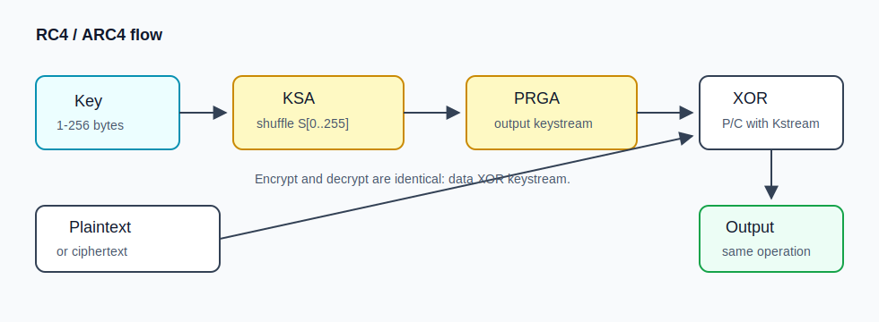

# RC4 / ARC4 算法整理

> RC4 在题里经常也会写成 ARC4，名字不一样，做题时基本按同一个东西看就行。它属于那种“原理不长，但很适合出逆向题”的算法：一个 256 字节的状态数组，被 key 打乱以后不断生成密钥流，最后和数据异或得到密文。

## 图解：RC4 整体流程



这张图主要是帮忙建立第一印象。RC4 不是直接拿 key 去异或明文，而是先用 key 把 `S[256]` 这张表洗一遍，后面再从这张表里持续生成密钥流。最后一步才是异或。因为异或本身可逆，所以同一套流程既能加密也能解密。

## 实战识别

新手看 RC4 不用先背 KSA、PRGA 这两个名字，先在反编译结果里找“256”。RC4 基本会有一个 256 字节数组，先被填成 `0,1,2,...,255`，然后进入 256 次交换。这个形状在 IDA/Ghidra 里很显眼，通常能看到类似 `for (i = 0; i < 256; i++) s[i] = i;` 的初始化，后面紧跟着 `j = j + s[i] + key[...]` 和交换 `s[i] / s[j]`。

认出来以后再看 key 从哪来。CTF 逆向里的 key 可能是硬编码字符串，也可能从用户输入、资源段、配置文件里拿出来；有些程序还会先对 key 做 MD5/SHA1，或者拼一个 salt。这里不要嫌麻烦，程序怎么处理 key，脚本里就要怎么处理。RC4 没有 block size，所以不用去找 padding，也不用纠结 ECB/CBC。真正要对齐的是 key、是否 drop 了前几字节密钥流，以及输入输出到底是 raw bytes、hex 还是 base64。

做题时我一般按这个顺序来：先确认有没有 `S[256]`，再确认有没有 KSA 和 PRGA 两段循环，然后找 key，最后拿密文跑脚本。只要密钥流对上，RC4 的解密不会再有别的花活。

## 1. 参数速查

| 项目 | 内容 |
| --- | --- |
| 类型 | 对称流密码 |
| 分组长度 | 无固定分组，按字节产生密钥流 |
| 常见密钥长度 | 1~256 字节；PyCryptodome 文档给出的范围是 8~2048 bit |
| IV / nonce | 原始 RC4 没有内置 IV |
| 核心结构 | 256 字节状态数组 `S`，先 KSA 初始化，再 PRGA 输出密钥流 |
| 安全状态 | 已不推荐用于真实安全场景；CTF 中常见于老协议、弱加密、逆向题 |

RC4 胜在短，几十行就能写完，逆向时也很显眼。它不是分组密码，所以别往 ECB、CBC、PKCS#7 那套上硬靠；它干的事就是生成一串和明文等长的密钥流，然后 XOR：

```text
ciphertext = plaintext XOR keystream
plaintext  = ciphertext XOR keystream
```

## 2. 算法详解

RC4 分成两个阶段。前半段是 KSA，也就是 Key Scheduling Algorithm，用 key 把初始的 `S[0..255]` 打乱；后半段是 PRGA，也就是 Pseudo-Random Generation Algorithm，从这个被打乱的状态里持续生成密钥流。

### 2.1 KSA：用密钥打乱 S 盒

初始状态：

```text
S = [0, 1, 2, ..., 255]
j = 0
```

对 `i = 0..255`：

```text
j = (j + S[i] + key[i mod key_len]) mod 256
swap(S[i], S[j])
```

KSA 的本质是：把密钥字节循环参与到 256 次交换里，得到一个依赖密钥的置换表 `S`。

这里最该记住的是“同一个 key 会洗出同一个 S”。原始 RC4 自己没有 nonce，所以同一个 key 拿去加密两段不同明文，就会重复同一段密钥流，后面自然变成 `C1 XOR C2 = P1 XOR P2`。有些协议会把 `nonce || long_term_key` 或 HMAC 派生结果再当 RC4 key，用协议层补一下，但这不是 RC4 自带的设计。

### 2.2 PRGA：持续输出密钥流

KSA 后设置：

```text
i = 0
j = 0
```

每输出 1 字节：

```text
i = (i + 1) mod 256
j = (j + S[i]) mod 256
swap(S[i], S[j])
t = (S[i] + S[j]) mod 256
K = S[t]
```

得到的 `K` 就是密钥流字节，明文字节与它 XOR 得到密文字节。

### 2.3 手算一轮时抓住三个变量

RC4 题里很常见的一种套路，是不给你名字，只给一段 KSA/PRGA 的代码。这个时候不用慌，先找有没有长度 256 的数组，是否初始化成 `0..255`，循环里是不是大量 `% 256` 或 `& 0xff`。如果后面还出现 `i += 1`、`j += S[i]`、交换 `S[i]` 和 `S[j]`，再输出 `S[(S[i] + S[j]) & 0xff]`，基本就能往 RC4 上靠了。

## 3. 代码实现与库调用

### 3.1 PyCryptodome 调用 ARC4

安装：

```bash
pip install pycryptodome
```

示例：

```python
from Crypto.Cipher import ARC4
from binascii import hexlify

key = b"this_is_a_rc4_key"
data = b"flag{rc4_demo}"

cipher = ARC4.new(key)
ct = cipher.encrypt(data)

decipher = ARC4.new(key)
pt = decipher.decrypt(ct)

print(hexlify(ct).decode())
print(pt)
```

RC4 是流密码，`encrypt()` 和 `decrypt()` 本质相同；但对象内部有状态，不能拿已经加密过数据的同一个对象从头解密。要重新 new 一个对象，保证密钥流从第 0 字节开始。

### 3.2 丢弃前 N 字节密钥流

RC4 早期输出有偏差。部分资料会使用 RC4-dropN，例如丢弃前 768 或 3072 字节。PyCryptodome 的 ARC4 支持 `drop` 参数：

```python
from Crypto.Cipher import ARC4

key = b"secret"
data = b"message"

cipher = ARC4.new(key, drop=3072)
ct = cipher.encrypt(data)

decipher = ARC4.new(key, drop=3072)
pt = decipher.decrypt(ct)
assert pt == data
```

CTF 中如果你发现官方脚本加密前调用了一段空加密，例如 `rc4.encrypt(b"\x00" * 1024)` 但没有保存结果，本质就是在 drop。

### 3.3 纯 Python 实现，适合断网环境

```python
def rc4_crypt(data: bytes, key: bytes, drop: int = 0) -> bytes:
    if not key:
        raise ValueError("RC4 key must not be empty")

    s = list(range(256))
    j = 0
    for i in range(256):
        j = (j + s[i] + key[i % len(key)]) & 0xff
        s[i], s[j] = s[j], s[i]

    i = j = 0
    out = bytearray()

    def next_byte() -> int:
        nonlocal i, j
        i = (i + 1) & 0xff
        j = (j + s[i]) & 0xff
        s[i], s[j] = s[j], s[i]
        return s[(s[i] + s[j]) & 0xff]

    for _ in range(drop):
        next_byte()

    for b in data:
        out.append(b ^ next_byte())
    return bytes(out)


key = b"Wiki"
pt = b"pedia"
ct = rc4_crypt(pt, key)
assert rc4_crypt(ct, key) == pt
print(ct.hex())
```

## 4. C 语言全流程实现

下面代码从 KSA、PRGA 到加解密完整实现。加密和解密调用同一个 `rc4_crypt`。

```c
#include <stdint.h>
#include <stdio.h>
#include <stdlib.h>
#include <string.h>

typedef struct {
    uint8_t s[256];
    uint8_t i;
    uint8_t j;
} RC4_CTX;

void rc4_init(RC4_CTX *ctx, const uint8_t *key, size_t key_len) {
    uint8_t j = 0;
    for (int i = 0; i < 256; i++) {
        ctx->s[i] = (uint8_t)i;
    }
    for (int i = 0; i < 256; i++) {
        j = (uint8_t)(j + ctx->s[i] + key[i % key_len]);
        uint8_t tmp = ctx->s[i];
        ctx->s[i] = ctx->s[j];
        ctx->s[j] = tmp;
    }
    ctx->i = 0;
    ctx->j = 0;
}

uint8_t rc4_next(RC4_CTX *ctx) {
    ctx->i = (uint8_t)(ctx->i + 1);
    ctx->j = (uint8_t)(ctx->j + ctx->s[ctx->i]);
    uint8_t tmp = ctx->s[ctx->i];
    ctx->s[ctx->i] = ctx->s[ctx->j];
    ctx->s[ctx->j] = tmp;
    return ctx->s[(uint8_t)(ctx->s[ctx->i] + ctx->s[ctx->j])];
}

void rc4_crypt(uint8_t *out, const uint8_t *in, size_t len,
               const uint8_t *key, size_t key_len, size_t drop) {
    RC4_CTX ctx;
    rc4_init(&ctx, key, key_len);
    for (size_t k = 0; k < drop; k++) {
        (void)rc4_next(&ctx);
    }
    for (size_t k = 0; k < len; k++) {
        out[k] = in[k] ^ rc4_next(&ctx);
    }
}

int main(void) {
    const uint8_t key[] = "this_is_a_rc4_key";
    const uint8_t msg[] = "flag{rc4_demo}";
    size_t len = strlen((const char *)msg);

    uint8_t *ct = malloc(len);
    uint8_t *pt = malloc(len + 1);
    if (!ct || !pt) return 1;

    rc4_crypt(ct, msg, len, key, strlen((const char *)key), 0);
    rc4_crypt(pt, ct, len, key, strlen((const char *)key), 0);
    pt[len] = 0;

    printf("cipher hex: ");
    for (size_t i = 0; i < len; i++) printf("%02x", ct[i]);
    printf("\nplain: %s\n", pt);

    free(ct);
    free(pt);
    return 0;
}
```

编译：

```bash
gcc rc4_demo.c -o rc4_demo
./rc4_demo
```

## 5. 例题里一般怎么用它

### 5.1 密钥流复用

RC4 最大的坑就是密钥流复用。如果同一个 key 加密两段消息：

```text
C1 = P1 XOR K
C2 = P2 XOR K
C1 XOR C2 = P1 XOR P2
```

于是只要你知道其中一段明文的某些位置，就能把对应位置的密钥流抠出来，再去还原另一段消息。CTF 里常用 `flag{`、文件头、JSON 固定字段当已知明文：

```python
known_p1 = b"flag{"
stream = bytes(c ^ p for c, p in zip(c1, known_p1))
recovered_p2 = bytes(c ^ k for c, k in zip(c2, stream))
```

### 5.2 明文头恢复

文件题里 RC4 也挺常见，尤其是 PNG、ZIP、PDF 这种有固定文件头的东西。先把密文头和已知文件头 XOR，就能拿到前几字节密钥流，后面再继续拖明文猜测。常见文件头可以先记这几个：

```text
PNG: 89504e470d0a1a0a
ZIP: 504b0304
PDF: 25504446
GIF: 47494638
```

### 5.3 逆向识别

逆向题里最典型的形状就是两个循环：第一个循环从 0 到 255 初始化并按 key 交换，第二个循环处理输入，每字节更新 `i/j` 后 XOR。如果 key 是硬编码的，很多时候不用再想别的，把 key 提出来跑同一份 RC4 就完事。

## 6. 易错点

RC4 没有内置 IV，题目里要是给了 IV，多半是协议自己把 IV 拼进 key，或者拿它做了一层派生。Python 里还要注意 ARC4 对象是有状态的，加密完以后不能拿同一个对象从头解密，应该重新初始化。遇到 RC4-dropN 时，加解密两边丢弃的字节数也必须一致。C 语言实现尽量用 `uint8_t`，否则 `char` 的符号扩展会让人查半天。最后也要说一句，RC4 现在更适合学习和 CTF，不适合新项目继续用。

## 7. 逆向和流量题排查流程

遇到疑似 RC4 的题，我一般先找 `S[256]`。如果看到它被初始化成 `0,1,2,...,255`，下一步就去找 KSA 的 256 次交换，表达式通常长得像 `j = j + S[i] + key[i % key_len]`。再往后看 PRGA，每处理 1 字节就更新 `i/j` 并从 `S[S[i] + S[j]]` 一类位置取值。确认算法后再看有没有 drop，有没有把 key 写成 hex 文本，有没有先 `fromhex`。最后拿 `flag{`、`ctf{` 或文件头做一下 sanity check，比盲猜舒服很多。

动态调试时可以偷个懒：如果程序是“读入密文 -> RC4 解密 -> 比较/输出”，那就别急着完整还原算法，先在比较函数、输出函数或者解密函数返回后下断点，看内存里的 buffer 有没有明文。很多入门逆向题根本不要求你把 RC4 写得多漂亮，只要你能在合适的位置把解密后的数据捞出来就行。

### 7.1 快速识别伪代码

RC4 伪代码经常长这样：

```c
for (i = 0; i < 256; i++)
    s[i] = i;

for (i = 0; i < 256; i++) {
    j = (j + s[i] + key[i % keylen]) & 0xff;
    swap(s[i], s[j]);
}

for (n = 0; n < len; n++) {
    i = (i + 1) & 0xff;
    j = (j + s[i]) & 0xff;
    swap(s[i], s[j]);
    out[n] = in[n] ^ s[(s[i] + s[j]) & 0xff];
}
```

如果题目把 `& 0xff` 写成 `% 256`，或者把数组类型写成 `char` 导致符号扩展，仍然可以按 RC4 思路还原，只是 C 代码里要注意强制转 `uint8_t`。

### 7.2 常见协议痕迹

RC4 曾经出现在 WEP、早期 TLS、一些老式软件授权和游戏资源加密里。题目描述里要是出现 `ARCFOUR`、`arcfour-hmac`、`RC4-MD5`、`drop[768]`、`S box 256`、`ksa/prga` 这些词，就可以先把 RC4 脚本掏出来试试。

## 8. 本篇离线脚本

下面脚本可以直接保存为 `rc4_tool.py`。它只依赖 Python 标准库，支持 hex/base64/raw 三种输入输出，适合线下赛断网使用。

```python
#!/usr/bin/env python3
import argparse
import base64
import sys


def decode_data(s: str, fmt: str) -> bytes:
    if fmt == "hex":
        return bytes.fromhex(s.strip())
    if fmt == "base64":
        return base64.b64decode(s.strip())
    return s.encode()


def encode_data(b: bytes, fmt: str) -> str:
    if fmt == "hex":
        return b.hex()
    if fmt == "base64":
        return base64.b64encode(b).decode()
    return b.decode(errors="replace")


def rc4(data: bytes, key: bytes, drop: int = 0) -> bytes:
    if not key:
        raise ValueError("key must not be empty")
    s = list(range(256))
    j = 0
    for i in range(256):
        j = (j + s[i] + key[i % len(key)]) & 0xff
        s[i], s[j] = s[j], s[i]

    i = j = 0

    def gen() -> int:
        nonlocal i, j
        i = (i + 1) & 0xff
        j = (j + s[i]) & 0xff
        s[i], s[j] = s[j], s[i]
        return s[(s[i] + s[j]) & 0xff]

    for _ in range(drop):
        gen()
    return bytes(x ^ gen() for x in data)


def main() -> None:
    ap = argparse.ArgumentParser(description="RC4/ARC4 encrypt/decrypt tool")
    ap.add_argument("data", help="input data")
    ap.add_argument("-k", "--key", required=True, help="key string or hex key")
    ap.add_argument("--key-hex", action="store_true", help="treat key as hex")
    ap.add_argument("--in-fmt", choices=["raw", "hex", "base64"], default="hex")
    ap.add_argument("--out-fmt", choices=["raw", "hex", "base64"], default="hex")
    ap.add_argument("--drop", type=int, default=0, help="drop first N keystream bytes")
    args = ap.parse_args()

    key = bytes.fromhex(args.key) if args.key_hex else args.key.encode()
    data = decode_data(args.data, args.in_fmt)
    sys.stdout.write(encode_data(rc4(data, key, args.drop), args.out_fmt) + "\n")


if __name__ == "__main__":
    main()
```

使用示例：

```bash
python rc4_tool.py 00112233 -k secret --in-fmt hex --out-fmt hex
python rc4_tool.py 2bbf... -k 736563726574 --key-hex --drop 3072
```

## 9. 参考资料

- PyCryptodome ARC4 文档：https://pycryptodome.readthedocs.io/en/stable/src/cipher/arc4.html
- RC4 原理说明：https://en.wikipedia.org/wiki/RC4
- CTF Wiki RC4：https://ctf-wiki.org/crypto/streamcipher/rc4/
- 博客园 RC4 算法学习笔记：https://www.cnblogs.com/goodhacker/p/3353465.html
