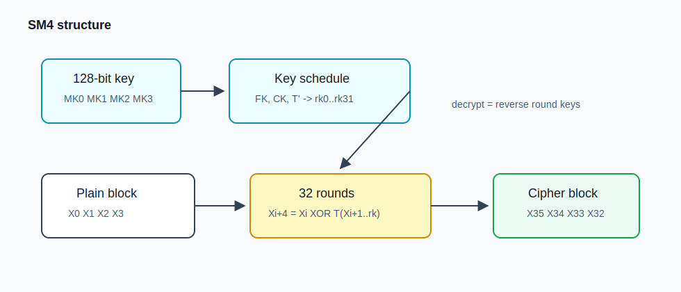

# SM4 算法整理

SM4 是国密体系里的对称分组算法，分组长度和密钥长度都是 128 bit。CTF 里它经常和 SM2、SM3 一起出现，场景也比较杂，可能是流量包，也可能是 Java/Python 业务代码、安卓逆向、接口加密。看到 `SM2/SM3/SM4` 这几个字样时，可以先把国密这条线拉出来。

## 图解：SM4 加密结构



这张图要同时看两条线。key 那边会扩展出 32 个轮密钥；数据那边把 16 字节明文拆成 `X0..X3`，做 32 轮迭代，最后按 `X35 X34 X33 X32` 反序输出。解密不用另写一套结构，只要把轮密钥倒过来用。

## 实战识别

SM4 在逆向里比 AES 还好认一点，因为国密实现经常把常量表老老实实放在二进制里。先搜 `A3 B1 BA C6`，这是 FK 的开头；再搜 S 盒开头 `D6 90 E9 FE CC E1 3D B7`。如果这两组都能找到，旁边又有 32 轮循环，基本就可以确认是 SM4。

如果是 Java、Android 或前端相关题，也可以先看字符串。`SM4/ECB/PKCS5Padding`、`SM4/CBC/PKCS7Padding`、`CryptSM4`、`sm4.encrypt` 这类名字一出来，算法就不用猜了。新手真正要花时间的是 key/iv 编码：它可能是 16 字节 ASCII，也可能是一串 hex 解码后的 16 字节，还可能先 base64 再 hex。看见 `Hex.decode()`、`bytes.fromhex()`、`Base64.decode()`，先把数据流捋清楚。

我觉得 SM4 题最适合按“先认常量，再追参数”的路线做。FK、CK、S 盒能说明这是 SM4，但 flag 能不能出来，还是看你有没有把 key、iv、模式和 padding 还原对。

## 1. 参数速查

| 项目 | 内容 |
| --- | --- |
| 类型 | 对称分组密码 |
| 分组长度 | 128 bit，16 字节 |
| 密钥长度 | 128 bit，16 字节 |
| 轮数 | 32 轮 |
| 结构 | 非平衡 Feistel-like 结构 |
| 基本操作 | XOR、循环左移、S 盒、线性变换 |
| 常见模式 | ECB、CBC、CTR、GCM 类似封装，实际看库支持 |
| CTF 特征 | `FK`、`CK` 常量表，32 轮，`0xd6 0x90 0xe9 0xfe` 开头的 S 盒 |

SM4 的核心：

```text
128 bit 明文 -> X0 X1 X2 X3，每个 32 bit
32 轮迭代:
    X(i+4) = X(i) XOR T(X(i+1) XOR X(i+2) XOR X(i+3) XOR rk(i))
输出:
    X35 X34 X33 X32
```

注意最后输出是反序。

## 2. 算法详解

### 2.1 轮函数

一轮更新：

```text
X(i+4) = X(i) XOR T(X(i+1) XOR X(i+2) XOR X(i+3) XOR rk(i))
```

这里的 `T` 不是一个单独查表，而是“过 S 盒 + 线性扩散”的合成变换：

```text
T(A) = L(tau(A))
```

`tau` 负责非线性，把 32 bit 拆成 4 个字节后逐个过 S 盒；`L` 负责扩散，用几次循环左移再 XOR 回来。看代码时如果先过 S 盒、再出现 `<<< 2/10/18/24`，基本就是 SM4 的加密轮函数。

### 2.2 加密线性变换 L

```text
L(B) = B XOR (B <<< 2) XOR (B <<< 10) XOR (B <<< 18) XOR (B <<< 24)
```

这里 `<<<` 表示 32 bit 循环左移。

### 2.3 密钥扩展

SM4 主密钥为 128 bit，拆成：

```text
MK0 MK1 MK2 MK3
```

先与系统参数 `FK` 异或：

```text
K0 = MK0 XOR FK0
K1 = MK1 XOR FK1
K2 = MK2 XOR FK2
K3 = MK3 XOR FK3
```

再生成 32 个轮密钥：

```text
rk(i) = K(i+4) = K(i) XOR T'(K(i+1) XOR K(i+2) XOR K(i+3) XOR CK(i))
```

密钥扩展使用的 `T'` 和加密的 `T` 类似，但线性变换不同：

```text
L'(B) = B XOR (B <<< 13) XOR (B <<< 23)
```

### 2.4 解密

SM4 解密不用写另一套算法，只需要把轮密钥倒序使用：

```text
加密: rk0, rk1, ..., rk31
解密: rk31, rk30, ..., rk0
```

这点和 DES 的 Feistel 解密思路类似。

## 3. 工作模式与 padding

SM4 核心只处理 16 字节分组。ECB/CBC 下需要 padding，常见是 PKCS#7：

```text
明文长度刚好 16 的倍数时，也要额外补一整块 0x10
```

模式这块和 AES 的直觉差不多。ECB 简单但会泄露重复块；CBC 需要 16 字节 IV，业务系统里很常见；CTR 不需要 padding，但 nonce/counter 不能复用；GCM 带认证能力，不过实际库支持没有 AES-GCM 那么普遍。

国密题里还要注意编码：很多业务代码会把 key/iv 写成 hex 字符串。例如 `"313233..."` 到底是 ASCII 字符串，还是 hex 解码后的字节，必须看代码。

## 4. 代码实现：Python 调用

### 4.1 gmssl 调用 SM4

安装：

```bash
pip install gmssl
```

ECB 示例：

```python
from gmssl.sm4 import CryptSM4, SM4_ENCRYPT, SM4_DECRYPT

key = b"0123456789abcdef"
pt = b"flag{sm4_demo}"

crypt = CryptSM4()
crypt.set_key(key, SM4_ENCRYPT)
ct = crypt.crypt_ecb(pt)  # gmssl 会按它的实现做填充

crypt.set_key(key, SM4_DECRYPT)
recovered = crypt.crypt_ecb(ct)
assert recovered == pt

print(ct.hex())
```

CBC 示例：

```python
from gmssl.sm4 import CryptSM4, SM4_ENCRYPT, SM4_DECRYPT

key = b"0123456789abcdef"
iv = b"1234567890abcdef"
pt = b"flag{sm4_cbc_demo}"

crypt = CryptSM4()
crypt.set_key(key, SM4_ENCRYPT)
ct = crypt.crypt_cbc(iv, pt)

crypt.set_key(key, SM4_DECRYPT)
recovered = crypt.crypt_cbc(iv, ct)
assert recovered == pt
```

gmssl 的封装比较适合快速解题，但不同版本对 padding 的细节要以本地实际为准。若题目给的是“裸 SM4 单块”，建议使用 OpenSSL 或自己实现 block 函数。

### 4.2 PyCryptodome 提醒

PyCryptodome 主文档里常用的是 AES/DES/ARC4 等算法；SM4 支持情况要看本地版本。如果比赛环境没有 SM4，优先准备 `gmssl` 或 OpenSSL 命令行。

## 5. 代码实现：C 语言 OpenSSL EVP 调用

OpenSSL 1.1.1 以后通常提供 SM4，例如 `EVP_sm4_cbc()`、`EVP_sm4_ecb()`、`EVP_sm4_ctr()`。下面是 CBC 示例。

```c
#include <openssl/evp.h>
#include <stdio.h>
#include <string.h>

int sm4_cbc_encrypt(const unsigned char *key, const unsigned char *iv,
                    const unsigned char *pt, int pt_len,
                    unsigned char *ct, int *ct_len) {
    EVP_CIPHER_CTX *ctx = EVP_CIPHER_CTX_new();
    int len = 0, total = 0;
    if (!ctx) return 0;
    if (EVP_EncryptInit_ex(ctx, EVP_sm4_cbc(), NULL, key, iv) != 1) return 0;
    if (EVP_EncryptUpdate(ctx, ct, &len, pt, pt_len) != 1) return 0;
    total += len;
    if (EVP_EncryptFinal_ex(ctx, ct + total, &len) != 1) return 0;
    total += len;
    *ct_len = total;
    EVP_CIPHER_CTX_free(ctx);
    return 1;
}

int sm4_cbc_decrypt(const unsigned char *key, const unsigned char *iv,
                    const unsigned char *ct, int ct_len,
                    unsigned char *pt, int *pt_len) {
    EVP_CIPHER_CTX *ctx = EVP_CIPHER_CTX_new();
    int len = 0, total = 0;
    if (!ctx) return 0;
    if (EVP_DecryptInit_ex(ctx, EVP_sm4_cbc(), NULL, key, iv) != 1) return 0;
    if (EVP_DecryptUpdate(ctx, pt, &len, ct, ct_len) != 1) return 0;
    total += len;
    if (EVP_DecryptFinal_ex(ctx, pt + total, &len) != 1) return 0;
    total += len;
    *pt_len = total;
    EVP_CIPHER_CTX_free(ctx);
    return 1;
}

int main(void) {
    const unsigned char key[16] = "0123456789abcdef";
    const unsigned char iv[16] = "1234567890abcdef";
    const unsigned char msg[] = "flag{sm4_c_demo}";
    unsigned char ct[128], pt[128];
    int ct_len = 0, pt_len = 0;

    if (!sm4_cbc_encrypt(key, iv, msg, (int)strlen((const char *)msg), ct, &ct_len)) {
        puts("encrypt failed");
        return 1;
    }
    if (!sm4_cbc_decrypt(key, iv, ct, ct_len, pt, &pt_len)) {
        puts("decrypt failed");
        return 1;
    }
    pt[pt_len] = 0;

    printf("cipher hex: ");
    for (int i = 0; i < ct_len; i++) printf("%02x", ct[i]);
    printf("\nplain: %s\n", pt);
    return 0;
}
```

编译：

```bash
gcc sm4_evp_demo.c -o sm4_evp_demo -lcrypto
```

如果编译时报 `EVP_sm4_cbc` 未声明，说明 OpenSSL 头文件版本太旧，换新版本或改用 GmSSL / Tongsuo。

## 6. 例题里一般怎么用它

### 6.1 国密组合

业务题里很常见的一套组合是：

```text
SM2 加密会话密钥
SM3 做摘要
SM4-CBC 加密数据
```

如果手里只有 SM4 密文，第一步不是硬解，而是找 key 和 IV 从哪来；如果题里还给了 SM2 私钥、接口泄露或者日志，通常就是先恢复会话密钥，再拿 SM4 解业务数据。

### 6.2 key/iv 编码混淆

key/iv 的编码是 SM4 题里最容易翻车的地方。下面这两种写法看起来都像“313233”，实际完全不是一回事：

```python
key = b"3132333435363738"          # 16 字节 ASCII 的一部分
key = bytes.fromhex("31323334...") # hex 解码后才是真 key
```

看到 Java 里的 `Hex.decode()`、Python 里的 `bytes.fromhex()`、JS 里的 `CryptoJS.enc.Hex.parse()` 要格外注意。很多题不是你 SM4 写错了，而是 key 字节一开始就拿错了。

### 6.3 CBC bit flipping 和 padding oracle

SM4-CBC 的攻击面和 AES-CBC 是一套逻辑。算法换成国密不会自动防篡改，如果程序只加密、不校验密文有没有被改过，IV bit flipping、中间块 bit flipping、padding 报错泄露、固定 IV 泄露首块这些问题照样会出现。做题时不要被“SM4”这个名字吓住，CBC 还是那个 CBC。

### 6.4 逆向识别

逆向识别 SM4，最舒服的办法是搜常量。`FK = a3b1bac6 56aa3350 677d9197 b27022dc` 很醒目，`CK` 有 32 个 word，S 盒开头也常见 `d6 90 e9 fe cc e1 3d b7 ...`。如果再看到 32 轮和解密时 reverse round key，基本就不用猜了。

## 7. 更完整的 SM4 细节

### 7.1 常量表识别

SM4 逆向里最容易识别的是三类常量。

系统参数 FK：

```text
A3B1BAC6 56AA3350 677D9197 B27022DC
```

固定参数 CK 一共 32 个 word，开头通常是：

```text
00070E15 1C232A31 383F464D 545B6269
70777E85 8C939AA1 A8AFB6BD C4CBD2D9
```

S 盒开头常见：

```text
D6 90 E9 FE CC E1 3D B7 16 B6 14 C2 28 FB 2C 05
```

只要二进制里搜到这些常量，基本可以确认 SM4。

### 7.2 字节序

SM4 标准描述通常按大端把 16 字节分成 4 个 32 bit word：

```text
X0 = bytes[0..3]
X1 = bytes[4..7]
X2 = bytes[8..11]
X3 = bytes[12..15]
```

也就是：

```python
int.from_bytes(block[0:4], "big")
```

但很多 C 实现为了效率会用宏读写，如果宏写错或平台相关，可能出现大小端差异。逆向时要跟着实现走，不要只跟标准文字走。

### 7.3 ECB/CBC 的 padding 差异

Python `gmssl` 的 `CryptSM4().crypt_ecb()`、`crypt_cbc()` 通常会处理 PKCS#7 风格 padding。但如果题目用的是 OpenSSL、Java BouncyCastle、前端 sm-crypto，不同库的参数可能写成：

```text
SM4/ECB/PKCS5Padding
SM4/CBC/PKCS7Padding
SM4/CBC/NoPadding
```

其中 `PKCS5Padding` 在 16 字节分组算法里很多库实际按 PKCS#7 处理。遇到 NoPadding 时，明文长度必须已经是 16 的倍数。

## 8. 国密题排查清单

1. 先看 key/iv 是 ASCII、hex 还是 base64。
2. 确认模式：ECB/CBC/CTR/GCM。
3. 确认 padding：PKCS#7、NoPadding、零填充。
4. 若是 CBC，确认 IV 是否固定、是否和密文拼在一起。
5. 若是 Web/Java 题，查 `SM4Utils`、`Cipher.getInstance()`、`Hex.decode()`、`Base64.decode()`。
6. 若是逆向题，搜 FK/CK/Sbox 常量。
7. 如果能解出部分明文但末尾错，先调 padding；如果全部乱码，再查 key 编码和大小端。

安卓或 Java 题里可以优先从调用链下手。比如 `Cipher.getInstance("SM4/CBC/PKCS5Padding")`、`setKey`、`crypt_cbc` 这些位置，往上追参数通常比硬啃 32 轮 SM4 轻松。native so 里如果是自实现，就搜 FK/S 盒常量；如果是调用 GmSSL、OpenSSL、Tongsuo 之类库，就先看导入和字符串。逆向的目标不是证明自己能手推 SM4，而是把它实际用的 key、iv、mode 和 padding 还原出来。

### 8.1 Python/Java/JS 编码坑

同一个字符串可能代表三种不同 key：

```text
"0123456789abcdef"                       # 16 字节 ASCII key
"30313233343536373839616263646566"       # 32 字符 hex 文本
bytes.fromhex("303132...")               # 解码后又变回 ASCII key
```

前端 CryptoJS/sm-crypto 常见：

```javascript
key = "0123456789abcdeffedcba9876543210"
```

这可能是 16 字节 hex key，也可能被当作 32 字节文本，取决于库 API。做题时必须看调用方式。

## 9. 代码实现：本篇离线脚本

下面保存为 `sm4_tool.py`。依赖 `gmssl`，支持 ECB/CBC，默认使用 gmssl 自带 padding。若需要 NoPadding，可以加 `--no-pad`，脚本会直接调用底层单块函数较麻烦；比赛中更常见做法是确保输入已经按库预期处理。这里保留 gmssl 高层接口，稳定优先。

```python
#!/usr/bin/env python3
import argparse
from gmssl.sm4 import CryptSM4, SM4_DECRYPT, SM4_ENCRYPT


def parse_key(s: str, raw: bool) -> bytes:
    return s.encode() if raw else bytes.fromhex(s)


def main() -> None:
    ap = argparse.ArgumentParser(description="SM4 ECB/CBC gmssl tool")
    ap.add_argument("data", help="hex data")
    ap.add_argument("-k", "--key", required=True, help="hex key by default")
    ap.add_argument("--key-raw", action="store_true", help="treat key as raw string")
    ap.add_argument("--iv", help="hex IV for CBC")
    ap.add_argument("--iv-raw", action="store_true")
    ap.add_argument("-m", "--mode", choices=["ecb", "cbc"], default="cbc")
    ap.add_argument("-d", "--decrypt", action="store_true")
    args = ap.parse_args()

    key = parse_key(args.key, args.key_raw)
    if len(key) != 16:
        raise ValueError("SM4 key must be 16 bytes")

    data = bytes.fromhex(args.data)
    crypt = CryptSM4()
    crypt.set_key(key, SM4_DECRYPT if args.decrypt else SM4_ENCRYPT)

    if args.mode == "ecb":
        out = crypt.crypt_ecb(data)
    else:
        if args.iv is None:
            raise ValueError("CBC needs --iv")
        iv = parse_key(args.iv, args.iv_raw)
        if len(iv) != 16:
            raise ValueError("SM4 IV must be 16 bytes")
        out = crypt.crypt_cbc(iv, data)
    print(out.hex())


if __name__ == "__main__":
    main()
```

示例：

```bash
python sm4_tool.py 666c61677b736d347d -k 30313233343536373839616263646566 --iv 31323334353637383930616263646566
python sm4_tool.py <cipher_hex> -k 30313233343536373839616263646566 --iv 31323334353637383930616263646566 -d
python sm4_tool.py <cipher_hex> -k 0123456789abcdef --key-raw --iv 1234567890abcdef --iv-raw -d
```

## 10. 参考资料

- GM/T 0002 SM4 相关标准信息：http://www.gmbz.org.cn/
- IETF RFC 8998 中的 SM4 套件说明：https://www.rfc-editor.org/rfc/rfc8998
- gmssl Python 项目：https://github.com/knitmesh/gmssl
- OpenSSL EVP 文档：https://docs.openssl.org/master/man3/EVP_EncryptInit/
- GMSSL 文档与项目：https://github.com/guanzhi/GmSSL
- CSDN SM4 原理与代码分析：https://blog.csdn.net/qq_37638441/article/details/121722493
- 博客园 SM4 算法介绍：https://www.cnblogs.com/JulianHuang/p/10151561.html
