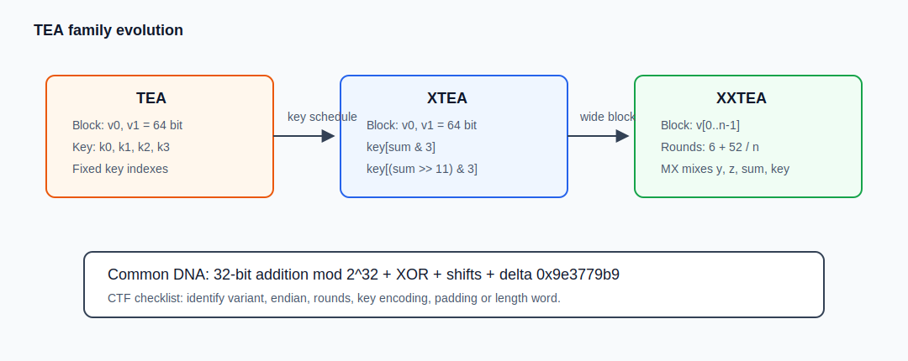

# TEA 家族：TEA、XTEA、XXTEA 原理与逆向识别

> TEA 这一家子很适合放在一起看。最早的 TEA 追求的就是“小”，核心操作只有加法、异或和移位；XTEA 在它的基础上改了 key 的使用方式；XXTEA 又把两个 32 位 word 的处理扩展到一整串 word。逆向题喜欢它们也不奇怪，常量醒目，代码不长，稍微改几个参数就能变成一道新题。

## 图解：TEA 家族演进



这张图可以先当作“第一眼判断表”。TEA 和 XTEA 都是 64 bit block，差别主要在 key 下标怎么取；XXTEA 则不再是两个 word 对着转，而是把整个 `uint32_t` 数组作为一个大块来搅。

## 实战识别

TEA 家族最适合从常量下手。反编译窗口里搜 `0x9e3779b9`，有时也会搜到 `0x61c88647` 或 `0xC6EF3720`。只要搜到了，再去看附近有没有 `<< 4`、`>> 5`、`sum`、四个 32 位 key。看到这些东西，不用急着细分，先把它当 TEA 家族处理。

接下来才区分具体是哪一个。key 下标固定在 `k0/k1/k2/k3` 的，多半是 TEA；出现 `sum & 3`、`(sum >> 11) & 3` 的，多半是 XTEA；出现 `6 + 52 / n`、`MX` 那种一长串 `z/y/sum/p/e` 混合表达式的，就往 XXTEA 想。新手最容易卡在大小端和轮数上，尤其是 x86 程序直接把 `char *` 强转成 `uint32_t *` 时，基本就是小端，不要拿大端脚本硬跑。

逆向时不用给变量名太大压力。IDA 可能把 `v0/v1` 叫成 `v7/v8`，把 key 数组叫成 `a2`，这不影响理解。你只要把“两个 32 位数据 word、四个 32 位 key word、sum 怎么变化、循环几次”抄准，后面 Python 复现就能慢慢调出来。

新手做这类题不要一开始就想着“我要完全理解密码学证明”。更实际的目标是把二进制里的加密函数还原到脚本里。先让脚本对上一组输入输出，再去谈是不是 TEA、XTEA 或 XXTEA。

## 1. 家族总览

| 算法 | 数据单位 | 密钥 | 常见轮数 | 逆向识别点 | 主要意义 |
| --- | --- | --- | --- | --- | --- |
| TEA | 64 bit，两个 `uint32_t` | 128 bit | 32 cycles | `0x9e3779b9`、`<<4`、`>>5`、固定 `k0..k3` | 最初的 Tiny Encryption Algorithm |
| XTEA | 64 bit，两个 `uint32_t` | 128 bit | 32 rounds | `sum & 3`、`(sum >> 11) & 3` | 改进 TEA 的 key 调度 |
| XXTEA | n 个 `uint32_t`，n >= 2 | 128 bit | `6 + 52 // n` | `MX`、`z/y/sum/e/p`、`6+52/n` | 宽分组，修正 Block TEA |

这三个算法的底子是一样的：都吃 128 bit key，都在 32 位无符号整数上做加法、异或和移位，也都绕不开 `delta = 0x9e3779b9`。它们没有像 AES 那样在库里形成特别统一的“模式 + padding”封装，所以 CTF 里一定要贴着题目实现走。Python 复现时尤其要记得 `& 0xffffffff`，不然 C 里的自然溢出在 Python 里不会自动发生。

最重要的区别：

```text
TEA/XTEA: 每次处理 8 字节 block
XXTEA:    把整个 uint32_t 数组作为一个大 block
```

## 2. 算法详解前的共同基础

### 2.1 32 位溢出

C 里的 `uint32_t` 会自然溢出：

```c
uint32_t x = 0xffffffff;
x += 1;  /* x == 0 */
```

Python 整数不会溢出，所以 TEA 家族脚本必须写：

```python
x = (x + y) & 0xffffffff
```

忘记掩码是这类脚本里最容易犯的错。表面上代码还在跑，输出也有十六进制，但和题目里的 C 程序已经不是同一个算法了。

### 2.2 delta

```text
delta = 0x9e3779b9
```

标准 TEA/XTEA 32 轮解密时的 sum：

```text
0xC6EF3720 = 0x9e3779b9 * 32 mod 2^32
```

逆向里也常见：

```text
0x61c88647 = 2^32 - 0x9e3779b9
```

出现这个值也要想到 TEA 家族，因为有些代码用减法维护 `sum`。

### 2.3 字节序

算法处理的是 `uint32_t`，题目给的是 bytes。必须确认大小端：

```python
struct.unpack("<2I", block)  # 小端
struct.unpack(">2I", block)  # 大端
```

逆向题如果看到 `uint32_t *p = (uint32_t *)buf`，在 x86/x64 上通常是小端。

## 3. TEA

### 3.1 参数

| 项目 | 内容 |
| --- | --- |
| 分组长度 | 64 bit |
| 密钥长度 | 128 bit |
| 状态 | `v0, v1` |
| key | `k0, k1, k2, k3` |
| 标准轮数 | 32 cycles |

### 3.2 加密流程

```text
sum = 0
repeat 32:
    sum += delta
    v0 += ((v1 << 4) + k0) XOR (v1 + sum) XOR ((v1 >> 5) + k1)
    v1 += ((v0 << 4) + k2) XOR (v0 + sum) XOR ((v0 >> 5) + k3)
```

TEA 的 key 使用方式很死板，更新 `v0` 用 `k0/k1`，更新 `v1` 用 `k2/k3`。这种固定感就是它和 XTEA 的一个分界。

### 3.3 解密流程

```text
sum = delta * 32
repeat 32:
    v1 -= ((v0 << 4) + k2) XOR (v0 + sum) XOR ((v0 >> 5) + k3)
    v0 -= ((v1 << 4) + k0) XOR (v1 + sum) XOR ((v1 >> 5) + k1)
    sum -= delta
```

解密顺序别写反。加密最后一步更新的是 `v1`，所以解密要先把 `v1` 减回去，再处理 `v0`。

### 3.4 TEA 识别点

```text
0x9e3779b9
循环 32 次
两个 uint32_t
四个 uint32_t key
<< 4
>> 5
固定 k0/k1/k2/k3
```

## 4. XTEA

### 4.1 XTEA 改了什么

TEA 的 key 下标固定，XTEA 把 key 下标和 `sum` 绑定：

```text
key[sum & 3]
key[(sum >> 11) & 3]
```

所以 XTEA 逆向特征比 TEA 更明显。

### 4.2 加密流程

```text
sum = 0
repeat rounds:
    v0 += (((v1 << 4) XOR (v1 >> 5)) + v1) XOR (sum + key[sum & 3])
    sum += delta
    v1 += (((v0 << 4) XOR (v0 >> 5)) + v0) XOR (sum + key[(sum >> 11) & 3])
```

### 4.3 解密流程

```text
sum = delta * rounds
repeat rounds:
    v1 -= (((v0 << 4) XOR (v0 >> 5)) + v0) XOR (sum + key[(sum >> 11) & 3])
    sum -= delta
    v0 -= (((v1 << 4) XOR (v1 >> 5)) + v1) XOR (sum + key[sum & 3])
```

### 4.4 TEA 与 XTEA 的关键对照

| 项目 | TEA | XTEA |
| --- | --- | --- |
| block | 64 bit | 64 bit |
| key | 128 bit | 128 bit |
| key 下标 | 固定 | 随 `sum` 变化 |
| 强特征 | `k0/k1/k2/k3` | `sum&3`、`sum>>11&3` |
| 轮数口径 | 32 cycles | 常见 32 rounds |

如果只看到 `delta`、`<<4`、`>>5`，还不能直接判断 TEA，要继续看 key 下标。

## 5. XXTEA

### 5.1 XXTEA 和 TEA/XTEA 的关系

TEA/XTEA 处理：

```text
[v0, v1]
```

XXTEA 处理：

```text
[v0, v1, v2, ..., v(n-1)]
```

它不是 8 字节一组独立加密，而是整个 word 数组一起扩散。

### 5.2 轮数

```text
rounds = 6 + 52 // n
```

`n` 是 32 位 word 数。看到 `6 + 52 / n` 基本就是 XXTEA。

### 5.3 MX 函数

常见宏：

```c
#define MX (((z >> 5 ^ y << 2) + (y >> 3 ^ z << 4)) ^ ((sum ^ y) + (key[(p & 3) ^ e] ^ z)))
```

这里的变量名看着短，其实分工很明确：`y` 是右侧 word，`z` 是左侧或者上一个已经更新过的 word，`p` 是当前下标，`e` 来自 `(sum >> 2) & 3`，最后 key 下标用 `(p & 3) ^ e` 算出来。把这几个位置对齐，XXTEA 的循环就没那么绕了。

Python 里推荐加满括号：

```python
mx = (((z >> 5) ^ (y << 2)) + ((y >> 3) ^ (z << 4))) ^ ((s ^ y) + (k[(p & 3) ^ e] ^ z))
```

### 5.4 加密流程

```text
rounds = 6 + 52 // n
sum = 0
z = v[n - 1]

repeat rounds:
    sum += delta
    e = (sum >> 2) & 3
    for p = 0..n-2:
        y = v[p + 1]
        v[p] += MX
        z = v[p]
    y = v[0]
    v[n - 1] += MX
```

### 5.5 解密流程

```text
sum = rounds * delta
y = v[0]

while sum != 0:
    e = (sum >> 2) & 3
    for p = n-1..1:
        z = v[p - 1]
        v[p] -= MX
        y = v[p]
    z = v[n - 1]
    v[0] -= MX
    sum -= delta
```

### 5.6 长度 word

XXTEA 核心只处理 `uint32_t[]`。实际字节串封装常见两种：

| 封装 | 表现 |
| --- | --- |
| 追加原始长度 word | 解密后最后 4 字节像明文长度 |
| 只补零到 4 字节倍数 | 解密后末尾可能有 `\x00` |

如果解密结果主体正确、末尾奇怪，优先检查是否用了长度 word。

## 6. 魔改排查表

| 检查项 | 标准 | 常见魔改 |
| --- | --- | --- |
| delta | `0x9e3779b9` | `0x61c88647`、随机常量 |
| TEA/XTEA 轮数 | 32 | 16、64、自定义 |
| sum 初值 | 0 | 非零固定值 |
| 字节序 | 题目自定 | 大端/小端混用 |
| key | 16 字节 | ASCII/hex/base64 混淆 |
| padding | 无标准 | PKCS#7、零填充、NoPadding |
| XXTEA 长度 | 常追加长度 word | 裸 word 数组 |
| 移位 | TEA `<<4 >>5` | 改移位数或改括号 |

做题时可以按这个顺序走：先判断它到底是 TEA、XTEA 还是 XXTEA，再确认 key 是 ASCII 还是 hex 解码，接着看 endian、rounds、delta，最后再处理 padding 或长度 word。不要一上来就怀疑密钥错，很多时候只是大小端或轮数没对上。拿 `flag{`、文件头或者题目给的样例明密文做验证，效率会高很多。

如果是 crackme 里拿 TEA 家族校验输入，动态调试也很好用。先找最终 `memcmp/strcmp` 或手写比较的位置，往前看一层，通常能看到程序把你的输入按 8 字节或 4 字节切开处理。这个时候记录输入 buffer、key buffer、加密后的结果，再回 Python 里复现。新手不要一开始就试图给每个临时变量起完美名字，先把输入输出对上。

## 7. 代码实现：Python 离线工具脚本

保存为 `tea_family_tool.py`。一个脚本同时支持 TEA、XTEA、XXTEA，但每个算法是独立函数，方便线下赛直接改魔改逻辑。

```python
#!/usr/bin/env python3
import argparse
import struct

MASK = 0xffffffff
DELTA = 0x9e3779b9


def pad(data, bs):
    n = bs - len(data) % bs
    return data + bytes([n]) * n


def unpad(data, bs):
    n = data[-1]
    if n < 1 or n > bs or data[-n:] != bytes([n]) * n:
        raise ValueError("bad padding")
    return data[:-n]


def tea_block(block, key, endian, rounds, dec=False):
    v0, v1 = struct.unpack(endian + "2I", block)
    k = struct.unpack(endian + "4I", key)
    if not dec:
        s = 0
        for _ in range(rounds):
            s = (s + DELTA) & MASK
            v0 = (v0 + (((v1 << 4) + k[0]) ^ (v1 + s) ^ ((v1 >> 5) + k[1]))) & MASK
            v1 = (v1 + (((v0 << 4) + k[2]) ^ (v0 + s) ^ ((v0 >> 5) + k[3]))) & MASK
    else:
        s = (DELTA * rounds) & MASK
        for _ in range(rounds):
            v1 = (v1 - (((v0 << 4) + k[2]) ^ (v0 + s) ^ ((v0 >> 5) + k[3]))) & MASK
            v0 = (v0 - (((v1 << 4) + k[0]) ^ (v1 + s) ^ ((v1 >> 5) + k[1]))) & MASK
            s = (s - DELTA) & MASK
    return struct.pack(endian + "2I", v0, v1)


def xtea_block(block, key, endian, rounds, dec=False):
    v0, v1 = struct.unpack(endian + "2I", block)
    k = struct.unpack(endian + "4I", key)
    if not dec:
        s = 0
        for _ in range(rounds):
            v0 = (v0 + ((((v1 << 4) ^ (v1 >> 5)) + v1) ^ (s + k[s & 3]))) & MASK
            s = (s + DELTA) & MASK
            v1 = (v1 + ((((v0 << 4) ^ (v0 >> 5)) + v0) ^ (s + k[(s >> 11) & 3]))) & MASK
    else:
        s = (DELTA * rounds) & MASK
        for _ in range(rounds):
            v1 = (v1 - ((((v0 << 4) ^ (v0 >> 5)) + v0) ^ (s + k[(s >> 11) & 3]))) & MASK
            s = (s - DELTA) & MASK
            v0 = (v0 - ((((v1 << 4) ^ (v1 >> 5)) + v1) ^ (s + k[s & 3]))) & MASK
    return struct.pack(endian + "2I", v0, v1)


def ecb(data, key, algo, dec, endian, rounds, use_pad):
    if len(key) != 16:
        raise ValueError("key must be 16 bytes")
    if not dec and use_pad:
        data = pad(data, 8)
    if len(data) % 8:
        raise ValueError("TEA/XTEA data length must be multiple of 8")
    f = tea_block if algo == "tea" else xtea_block
    out = b"".join(f(data[i:i + 8], key, endian, rounds, dec) for i in range(0, len(data), 8))
    return unpad(out, 8) if dec and use_pad else out


def xx_to_words(data, include_len):
    raw_len = len(data)
    n = (raw_len + 3) // 4
    data = data.ljust(n * 4, b"\0")
    words = list(struct.unpack("<%dI" % n, data)) if n else []
    if include_len:
        words.append(raw_len)
    return words


def xx_to_bytes(words, include_len):
    if include_len:
        raw_len = words[-1]
        words = words[:-1]
    else:
        raw_len = len(words) * 4
    data = struct.pack("<%dI" % len(words), *[w & MASK for w in words])
    if include_len:
        if raw_len < 0 or raw_len > len(data):
            raise ValueError("bad length word")
        return data[:raw_len]
    return data


def xx_key(key):
    return list(struct.unpack("<4I", key.ljust(16, b"\0")[:16]))


def xx_encrypt_words(v, k):
    n = len(v)
    if n < 2:
        return v[:]
    v = v[:]
    rounds = 6 + 52 // n
    s = 0
    z = v[-1]
    for _ in range(rounds):
        s = (s + DELTA) & MASK
        e = (s >> 2) & 3
        for p in range(n - 1):
            y = v[p + 1]
            mx = (((z >> 5) ^ (y << 2)) + ((y >> 3) ^ (z << 4))) ^ ((s ^ y) + (k[(p & 3) ^ e] ^ z))
            v[p] = (v[p] + mx) & MASK
            z = v[p]
        y = v[0]
        p = n - 1
        mx = (((z >> 5) ^ (y << 2)) + ((y >> 3) ^ (z << 4))) ^ ((s ^ y) + (k[(p & 3) ^ e] ^ z))
        v[p] = (v[p] + mx) & MASK
        z = v[p]
    return v


def xx_decrypt_words(v, k):
    n = len(v)
    if n < 2:
        return v[:]
    v = v[:]
    rounds = 6 + 52 // n
    s = (rounds * DELTA) & MASK
    y = v[0]
    while s:
        e = (s >> 2) & 3
        for p in range(n - 1, 0, -1):
            z = v[p - 1]
            mx = (((z >> 5) ^ (y << 2)) + ((y >> 3) ^ (z << 4))) ^ ((s ^ y) + (k[(p & 3) ^ e] ^ z))
            v[p] = (v[p] - mx) & MASK
            y = v[p]
        z = v[-1]
        p = 0
        mx = (((z >> 5) ^ (y << 2)) + ((y >> 3) ^ (z << 4))) ^ ((s ^ y) + (k[(p & 3) ^ e] ^ z))
        v[0] = (v[0] - mx) & MASK
        y = v[0]
        s = (s - DELTA) & MASK
    return v


def xxtea(data, key, dec, use_len):
    k = xx_key(key)
    if dec:
        if len(data) % 4:
            raise ValueError("XXTEA ciphertext length must be multiple of 4")
        return xx_to_bytes(xx_decrypt_words(xx_to_words(data, False), k), use_len)
    v = xx_to_words(data, use_len)
    if len(v) < 2:
        v.append(0)
    return xx_to_bytes(xx_encrypt_words(v, k), False)


def main():
    ap = argparse.ArgumentParser(description="TEA/XTEA/XXTEA tool")
    ap.add_argument("data", help="hex data")
    ap.add_argument("-a", "--algo", choices=["tea", "xtea", "xxtea"], required=True)
    ap.add_argument("-k", "--key", required=True, help="hex key by default")
    ap.add_argument("--key-raw", action="store_true")
    ap.add_argument("-d", "--decrypt", action="store_true")
    ap.add_argument("-r", "--rounds", type=int, default=32)
    ap.add_argument("--big", action="store_true")
    ap.add_argument("--no-pad", action="store_true")
    ap.add_argument("--xx-no-len", action="store_true")
    args = ap.parse_args()

    key = args.key.encode() if args.key_raw else bytes.fromhex(args.key)
    data = bytes.fromhex(args.data)
    if args.algo in ("tea", "xtea"):
        out = ecb(data, key, args.algo, args.decrypt, ">" if args.big else "<", args.rounds, not args.no_pad)
    else:
        out = xxtea(data, key, args.decrypt, not args.xx_no_len)
    print(out.hex())


if __name__ == "__main__":
    main()
```

使用示例：

```bash
python tea_family_tool.py 666c61677b7465617d -a tea -k 30313233343536373839616263646566
python tea_family_tool.py <cipher_hex> -a tea -k 30313233343536373839616263646566 -d
python tea_family_tool.py <cipher_hex> -a xtea -k 30313233343536373839616263646566 -d -r 64
python tea_family_tool.py <cipher_hex> -a xxtea -k 30313233343536373839616263646566 -d
```

## 8. 代码实现：C 语言核心速查

### 8.1 TEA block

```c
#include <stdint.h>
#define DELTA 0x9e3779b9u

void tea_encrypt(uint32_t v[2], const uint32_t k[4]) {
    uint32_t v0 = v[0], v1 = v[1], sum = 0;
    for (int i = 0; i < 32; i++) {
        sum += DELTA;
        v0 += ((v1 << 4) + k[0]) ^ (v1 + sum) ^ ((v1 >> 5) + k[1]);
        v1 += ((v0 << 4) + k[2]) ^ (v0 + sum) ^ ((v0 >> 5) + k[3]);
    }
    v[0] = v0; v[1] = v1;
}

void tea_decrypt(uint32_t v[2], const uint32_t k[4]) {
    uint32_t v0 = v[0], v1 = v[1], sum = DELTA * 32u;
    for (int i = 0; i < 32; i++) {
        v1 -= ((v0 << 4) + k[2]) ^ (v0 + sum) ^ ((v0 >> 5) + k[3]);
        v0 -= ((v1 << 4) + k[0]) ^ (v1 + sum) ^ ((v1 >> 5) + k[1]);
        sum -= DELTA;
    }
    v[0] = v0; v[1] = v1;
}
```

### 8.2 XTEA block

```c
void xtea_encrypt(uint32_t v[2], const uint32_t k[4], unsigned rounds) {
    uint32_t v0 = v[0], v1 = v[1], sum = 0;
    for (unsigned i = 0; i < rounds; i++) {
        v0 += ((((v1 << 4) ^ (v1 >> 5)) + v1) ^ (sum + k[sum & 3]));
        sum += DELTA;
        v1 += ((((v0 << 4) ^ (v0 >> 5)) + v0) ^ (sum + k[(sum >> 11) & 3]));
    }
    v[0] = v0; v[1] = v1;
}

void xtea_decrypt(uint32_t v[2], const uint32_t k[4], unsigned rounds) {
    uint32_t v0 = v[0], v1 = v[1], sum = DELTA * rounds;
    for (unsigned i = 0; i < rounds; i++) {
        v1 -= ((((v0 << 4) ^ (v0 >> 5)) + v0) ^ (sum + k[(sum >> 11) & 3]));
        sum -= DELTA;
        v0 -= ((((v1 << 4) ^ (v1 >> 5)) + v1) ^ (sum + k[sum & 3]));
    }
    v[0] = v0; v[1] = v1;
}
```

### 8.3 XXTEA word array

```c
#define MX (((z >> 5 ^ y << 2) + (y >> 3 ^ z << 4)) ^ ((sum ^ y) + (key[(p & 3) ^ e] ^ z)))

void xxtea_encrypt(uint32_t *v, int n, const uint32_t key[4]) {
    if (n < 2) return;
    uint32_t y, z = v[n - 1], sum = 0, e;
    unsigned rounds = 6 + 52 / (unsigned)n;
    while (rounds--) {
        sum += DELTA;
        e = (sum >> 2) & 3;
        for (int p = 0; p < n - 1; p++) {
            y = v[p + 1];
            v[p] += MX;
            z = v[p];
        }
        int p = n - 1;
        y = v[0];
        v[p] += MX;
        z = v[p];
    }
}
```

## 9. 魔改与做题套路

快速分类可以这么记：

```text
0x9e3779b9 + 固定 k0/k1/k2/k3       -> TEA
0x9e3779b9 + sum&3 + sum>>11&3     -> XTEA
0x9e3779b9 + 6+52/n + MX/z/y/e/p   -> XXTEA
```

真正卡人的通常不是公式本身，而是实现细节。Python 忘记 `& 0xffffffff`、大小端用错、把 hex 文本当 ASCII、TEA/XTEA 轮数口径没对上、XXTEA 忘记长度 word，这些都很常见。还有一个坑是把 XXTEA 当成 8 字节 ECB 去切，结果当然越解越怪，因为它本来处理的是整个 word 数组。

## 10. 参考资料

- TEA 原始说明页：https://www.cl.cam.ac.uk/ftp/papers/djw-rmn/djw-rmn-tea.html
- TEA/XTEA 相关论文索引：https://www.cl.cam.ac.uk/ftp/papers/djw-rmn/
- CTF Wiki TEA/XTEA/XXTEA：https://ctf-wiki.org/crypto/blockcipher/tea/
- XXTEA 说明：https://www.movable-type.co.uk/scripts/tea-block.html
- Python xxtea 包：https://pypi.org/project/xxtea/
- CSDN TEA/XTEA/XXTEA 系列笔记：https://blog.csdn.net/qq_43390703/article/details/105541782
- 博客园 TEA 算法分析：https://www.cnblogs.com/shangdawei/p/4600697.html
